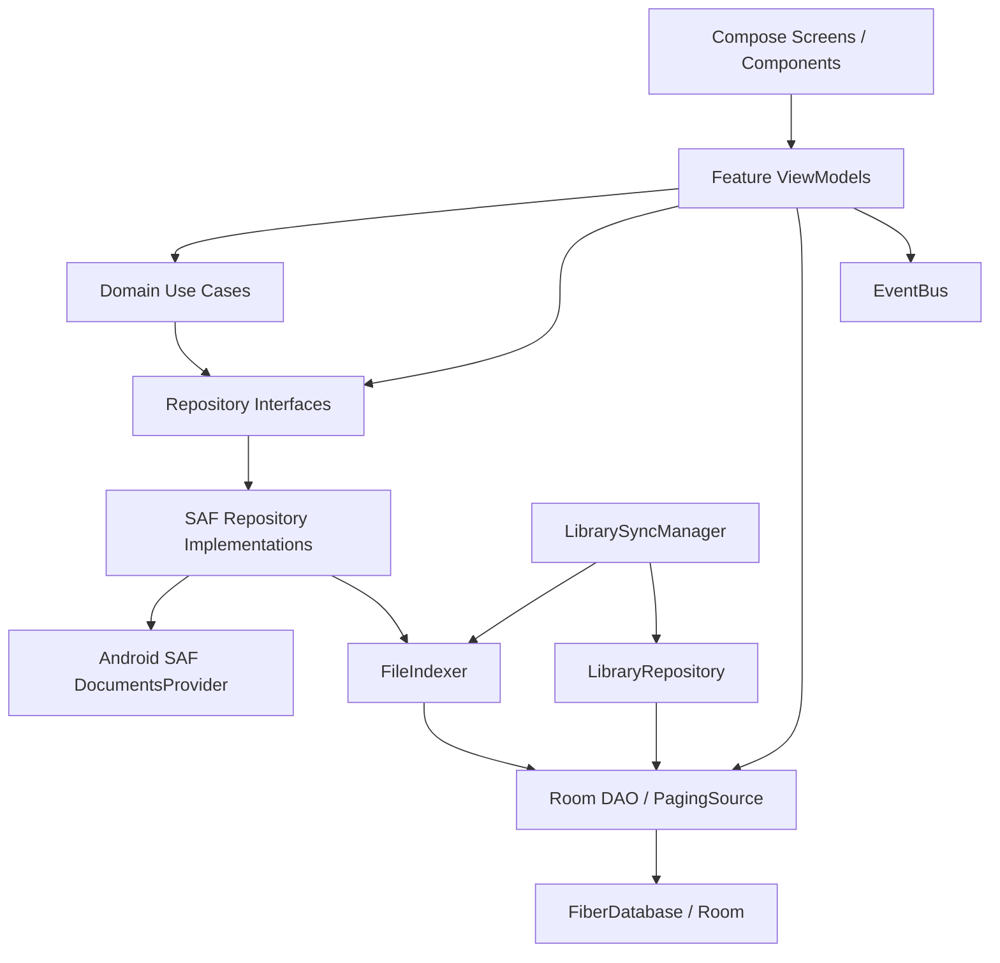

# Fiber 架构与近期大改动审查报告

> 审查日期：2026-08-09
> 审查版本：`63b7ec6ab4f2d65e7dccc8b72c0bde06dc4716a0`（`main`）
> 审查范围：`9ac340a^..63b7ec6`，共 8 个提交、36 个文件、约 1242 行新增/127 行删除
> 重点：全库搜索、共享顶栏、Markdown 图片与附件支持、内存/资源生命周期

## 1. 结论摘要

本轮静态审查**没有发现可以直接确认的 Activity、View、Context、Flow 订阅或协程堆内存泄漏**。现有单例使用 `ApplicationContext`，文件流和 Cursor 基本都由 `use` 关闭，ViewModel 协程由 `viewModelScope` 管理，Compose 收集使用生命周期感知 API；Markwon 4.6.2 的 `AsyncDrawableScheduler` 也会在 `TextView` detach 时自动取消 drawable 回调。

但当前仍有两个需要优先处理的资源问题：

1. **大库同步存在明显的峰值内存/OOM 风险**：同步一次性读取数据库内全部正文，又在内存中累计所有待更新文件的完整正文。它不是“对象永远不释放”的泄漏，但在大库或首次迁移时可能表现得和泄漏相似。
2. **附件存在确定的磁盘资源泄漏**：图片在用户选择后立即复制到 `attachments/`，但移除附件、放弃编辑、保存失败或退出草稿时没有删除已复制文件，孤儿图片会永久累积。

另外发现两项中等优先级的正确性/性能问题：显式目标库创建文件时可能按“当前活动库”写错索引归属；Markdown 渲染请求在慢渲染期间可能丢失，且编辑模式仍持续保存完整 `Spanned` 预览结果。

## 2. 风险清单

| 优先级 | 类型 | 结论 | 主要位置 |
|---|---|---|---|
| P1 | 峰值内存/OOM | 同步同时持有全库正文和全部待更新正文，库越大风险越高 | `FileIndexer.kt:49-95`、`MarkdownFileDao.kt:175-176` |
| P1 | 磁盘资源泄漏 | 已复制图片缺少回滚/删除协议，移除或放弃后成为孤儿文件 | `AttachmentRepository.kt:6-10`、`QuickNoteViewModel.kt:65-91`、`EditorViewModel.kt:133-159` |
| P2 | 数据一致性 | `createMarkdownFile(folderUri=...)` 最后用活动库 ID 建索引，目标库与活动库不一致时归属错误 | `FileRepositoryImpl.kt:60-100` |
| P2 | 内存/性能 | 编辑态每次输入仍构建并长期持有完整 `Spanned`；大文档及多图文档开销明显 | `EditorViewModel.kt:127-149`、`EditorViewModel.kt:213-230` |
| P2 | 正确性 | `MutableSharedFlow` 缓冲仅 1，`tryEmit` 结果被忽略；慢渲染期间连续输入可丢掉最终请求 | `EditorViewModel.kt:71-78`、`EditorViewModel.kt:213-215` |
| P2 | 测试缺口 | 新增 SAF 附件实现、URI 解析、清理语义、图片 View 生命周期无直接测试 | `AttachmentRepositoryImpl.kt`、`EditorPreviewPane.kt` |
| P3 | 调度器使用 | SAF `DocumentFile.findFile` 在 `Dispatchers.Default` 的渲染路径执行，应归入 IO 调度 | `RenderMarkdownUseCase.kt:34-50`、`AttachmentRepositoryImpl.kt:100-118` |
| P3 | 依赖治理 | 主 Hilt 为 2.52，测试 Hilt 固定为 2.48；Coil 0.13 较旧但与 Markwon 4.6.2 耦合，不能单独盲升 | `app/build.gradle.kts` |

## 3. 内存与资源生命周期审查

### 3.1 未发现明确堆泄漏的路径

- `FileRepositoryImpl`、`AttachmentRepositoryImpl`、`RenderMarkdownUseCase` 等单例只持有 `ApplicationContext`，没有持有 Activity Context。
- SAF 输入流、输出流和数据库 Cursor 均通过 `use` 关闭；异常路径也会离开 `use` 块。
- ViewModel 内持续收集的 Flow 和渲染协程都在 `viewModelScope` 中，ViewModel 清除时会取消。
- Compose 页面使用 `collectAsStateWithLifecycle`；`LaunchedEffect`、`DisposableEffect` 和 `rememberCoroutineScope` 都绑定组合生命周期。
- `EventBus` 的 `SharedFlow` 为 `replay = 0`、额外缓冲 16，不会无限保存历史事件。
- `PreviewCache` 使用最大 100 项的 LRU 风格 `LinkedHashMap`，不会无界增长。
- 字体缓存理论上是 Map，但设置只允许 80/90/100/110/120 五档，实际容量有界。
- Markwon 4.6.2 的 `AsyncDrawableScheduler.schedule(TextView)` 会注册 attach-state listener；View detach 时调用 `unschedule` 并清空 drawable callback。当前预览在换内容前也显式调用了 `unschedule`。

因此，近期提交 `63b7ec6` 增加的异步图片调度**目前不判定为 TextView 泄漏**。

### 3.2 P1：同步峰值内存风险

当前同步过程的内存形态如下：

```text
全部 SAF 元数据
  + Room 返回的全部 MarkdownFileEntity（包含 content_text 全文）
  + 所有新增/修改文件的完整 content String
  + filesToUpsert 中再次长期持有的全文
  + Room 写入/UTF-8 转换的临时对象
```

`getAllByLibrary()` 使用 `SELECT *`，而 `MarkdownSyncPlanner` 实际只需要 URI、修改时间以及预览/搜索正文是否为空。随后 `FileIndexer` 把每个变更文件的全文放入 `filesToUpsert`，直到整个库读取完才一次性写 Room。首次索引、数据库迁移触发重建或大量文件同时变化时，内存占用大致随“全库正文总量 + 本次变化正文总量”增长。

建议：

1. 新增轻量投影 `MarkdownIndexSnapshot`，DAO 只查询同步比较所需字段，不加载 `content_text`。
2. 待更新文件按 25-100 个一批读取并 upsert，批次结束立即释放正文字符串。
3. 删除操作与批量 upsert 保持明确事务边界；不要为了一个超大事务把所有正文留在堆里。
4. `updateFileAfterSave()` 的 `content.toByteArray().size` 会额外分配整份 ByteArray，可改为写入后查询文档大小，或复用实际写入字节。
5. 用生成的大库做基准：例如 5000 个文件、正文总量 500 MB，记录同步前后 Java heap 峰值和耗时。

### 3.3 P1：附件孤儿文件

`copyImage()` 在用户选图时立即创建实体文件。当前 Repository 只有 `copyImage` 和 `resolveUri`，没有 `delete`、提交或回滚接口：

- 快速记录中点击“移除图片”仅从 `attachments` List 过滤，磁盘文件不删。
- 快速记录草稿退出、进程被杀或保存失败后，已复制图片不删。
- 编辑器插图后选择“不保存退出”，Markdown 未引用该图片，但文件已永久存在。
- 编辑器保存失败后退出也会留下孤儿图片。

建议引入“暂存附件”协议：

1. `copyImage` 返回带唯一 ID/URI 的 staged attachment。
2. 保存成功后执行 `commit(stagedAttachments)`。
3. 移除、放弃、ViewModel 清除且未保存时执行 `rollback/delete`。
4. 额外提供低频清理任务：扫描 `attachments/`，与全部 Markdown 引用建立差集；设置宽限期，避免误删刚创建但尚未保存的图片。

仅依靠定时清理不够，因为 Markdown 解析可能漏掉复杂链接语法；优先实现本次会话内的确定性回滚。

### 3.4 编辑器常驻内存与渲染队列

编辑器 ViewModel 在修改后可能同时持有：

- `originalContent`：用于未保存判断；
- `TextFieldValue.text`：当前正文；
- `EditorRenderState.renderedMarkdown`：包含 span 和异步图片 drawable 的渲染树；
- `TextView.text`：预览展示时对同一渲染结果的引用。

这不是泄漏，ViewModel 出栈后会整体释放，但大文档会形成较高常驻内存。当前即使处于编辑模式，`onTextValueChange()` 仍会持续渲染并保存 `Spanned`。

建议只在以下时机渲染：进入预览、预览模式下正文变化、保存后需要刷新预览。编辑模式可清空旧 `renderedMarkdown`，或只保留最近一次预览并暂停后续解析。未保存状态也可改为 dirty 标志加版本号，避免在不需要精确回滚时长期保留完整原文。

渲染请求建议改为 `MutableStateFlow<String>` + `debounce` + `collectLatest`。这样天然保留最新内容，并会取消旧渲染；处理取消时必须重新抛出 `CancellationException`，不要被通用 `catch (Exception)` 吞掉。

## 4. 当前架构

### 4.1 技术栈

| 领域 | 当前实现 |
|---|---|
| UI | Jetpack Compose + Material 3 |
| 导航 | Navigation Compose + `SharedTransitionLayout` |
| 状态 | ViewModel + StateFlow/SharedFlow/Channel |
| 依赖注入 | Hilt SingletonComponent + Hilt ViewModel |
| 文件存储 | Android SAF / `DocumentsContract` / `DocumentFile` |
| 索引与查询 | Room + Paging 3 |
| 设置 | Preferences DataStore |
| Markdown | Markwon 4.6.2 + Coil 0.13 图片插件 |
| 并发 | Kotlin Coroutines |
| 日志 | Timber（仅 Debug 植树） |

### 4.2 分层与依赖关系



整体是单 app module 内的分层架构，包结构清楚，但边界不是完全严格：

- UI 层的 `FileListViewModel` 直接依赖 `MarkdownFileDao`，绕过 Repository/UseCase。
- `LibraryRepository` 是具体类并位于 `data.local.library`，同时承担 DAO 封装和领域操作。
- `FileIndexer` 既负责同步编排，又负责全文读取、预览派生和数据库批量写入。
- `EventBus` 用于跨 ViewModel 刷新通知，简单有效，但事件无持久状态，订阅者缺席时事件会丢失。
- README 中“Room 只存元数据”的描述已经过时；当前 `markdown_files.content_text` 保存完整正文以支持 `LIKE` 搜索。

### 4.3 核心数据流

#### 启动与索引同步

```text
MainActivity 首帧后
  -> 校验 SAF 授权和库有效性
  -> 同步活动库
  -> 延迟同步非活动库
  -> MarkdownFileScanner 扫描目录
  -> MarkdownSyncPlanner 对比 Room
  -> 读取变更文件全文并派生 preview / hasImage
  -> MarkdownIndexWriter 写 Room
  -> EventBus 通知文件列表刷新
```

`FileIndexer` 内部使用单个 `Mutex`，避免多个库同时改索引，降低数据库竞争和并发内存峰值。这一点合理，但也意味着任何慢 Provider 或超大库会阻塞其他库的增量更新。

#### 列表与搜索

```text
搜索输入
  -> FileListViewModel 300 ms debounce
  -> combine(库、查询、范围、排序、刷新版本)
  -> flatMapLatest 创建 Pager
  -> Room PagingSource
  -> MarkdownFileSummary（不含 content_text）
  -> Compose LazyColumn
```

近期全库搜索改动的方向正确：展示查询采用 `MarkdownFileSummary` 投影，不把完整正文送进 Paging/UI。主要瓶颈在 SQL 使用 `%query%` 对 `content_text` 全表扫描；库继续增大后，应迁移到 Room FTS4/FTS5 虚表，而不是继续扩展 `LIKE` 查询。

#### 编辑、预览与图片

```text
读取 SAF Markdown
  -> EditorViewModel / TextFieldValue
  -> debounce 渲染请求
  -> RenderMarkdownUseCase
  -> 解析 attachments/... 相对路径为 content URI
  -> Markwon + Coil 生成 Spanned/AsyncDrawable
  -> AndroidView(TextView in ScrollView)
```

图片选择流为“先复制到库根目录 `attachments/`，再插入 Markdown 引用”。这使 Markdown 保存失败与文件复制成功成为两个独立事务，正是孤儿附件问题的根源。

#### 快速记录

快速记录 ViewModel 维护草稿正文和附件元数据，保存时通过 `CreateMarkdownFileUseCase` 创建文件，再通过 EventBus 刷新列表。一次性成功事件使用 Channel，生命周期模型基本合理。需要修正的是目标库归属和附件回滚。

## 5. 近期大改动评价

### 5.1 全库搜索与排序（`9ac340a`）

优点：

- 搜索范围、排序和查询都进入响应式 Pager 参数，使用 `flatMapLatest` 可取消旧 PagingSource。
- 搜索列表投影排除了 `content_text`，避免将完整正文加载到 UI 堆。
- 跨库结果携带 `libraryId/libraryName`，展示和导航语义更完整。

风险：

- `%query%` 的全库正文 LIKE 查询无法使用普通 B-tree 索引，数据规模增长后延迟会近似线性增加。
- 打开跨库结果前切换活动库是隐式全局状态变更；后续应让编辑器/附件逻辑显式使用文件所属库，减少对活动库的依赖。

### 5.2 搜索 UI 与共享顶栏（`1a42616` 至 `8ade438`）

共享元素状态局限在 `SharedTransitionLayout` 和对应 NavBackStackEntry，未发现静态生命周期泄漏。搜索页退出时清空查询，Pager 和 ViewModel 会随搜索目的地出栈清理。

主要问题是 UI 文件体积：`SearchScreen.kt` 已超过 800 行，包含页面状态、筛选、骨架屏、反馈卡和结果项。继续迭代前建议按 `SearchRoute`、`SearchHeader`、`SearchFilters`、`SearchResults` 拆分，以降低重组问题和评审难度。这是维护性建议，不是必须立即重构。

### 5.3 图片与附件（`3a15be9`、`63b7ec6`）

优点：

- Repository 使用 Application Context，复制流正确关闭，失败时会删除本次创建的半成品。
- 仅允许 `attachments/` 且拒绝 `..` 路径段，基础路径约束合理。
- Markwon 图片依赖与异步 drawable 调度已经接通。
- `has_image` 进入索引摘要，列表和搜索无需读取正文即可展示图片标记。

风险：

- 缺少已成功复制附件的提交/回滚生命周期。
- 附件实现没有单元测试或 Provider 集成测试。
- `resolveUri` 每次渲染、每张图片都逐段调用 `DocumentFile.findFile`，图片多时 Provider 查询次数较高。
- 图片大小和 MIME 只做基础检查，缺少文件大小上限、异常图片/解码失败测试。

## 6. 数据一致性问题

`FileRepositoryImpl.createMarkdownFile(folderUri, ...)` 明确接受目标目录，但创建成功后用 `libraryRepository.getActiveLibrary()` 的 ID 和根 URI 建索引。当快速记录已有附件时，ViewModel 会固定使用第一张附件的 `libraryFolderUri` 保存笔记；如果用户期间切换了活动库，文件会写入旧库，但索引暂时登记到新活动库。

建议把 `libraryId` 与 `folderUri` 一起作为显式参数传到创建流程，或由 LibraryRepository 根据 folder URI 查询唯一库实体。Repository 不应在已经收到显式目标后再次读取可变全局“活动库”。

## 7. 测试与静态检查

执行命令：

```powershell
.\gradlew.bat testDebugUnitTest lintDebug
```

结果：

- 构建成功。
- 19 个测试类、202 个单元测试，0 failure、0 error、0 skipped。
- Android Lint：0 error、77 warning、4 hint。
- Lint 没有报告资源未关闭或 Android Context 泄漏。

与本次变更直接相关的已有覆盖：

- `EditorViewModelTest` 覆盖插图 Markdown 插入。
- `QuickNoteViewModelTest` 覆盖附件保存组合。
- `MarkdownUtilsTest` 覆盖基础图片识别。
- `AssociationMenuTest` 覆盖关联触发解析。

关键缺口：

- `AttachmentRepositoryImpl.copyImage` 的成功、输入流为空、输出流为空、异常清理、非图片 MIME。
- `resolveUri` 的根目录、嵌套路径、非法 `..`、Provider 异常。
- 快速记录移除/放弃和编辑器不保存退出时的附件回滚。
- 大库同步的内存基准与批处理验证。
- `EditorPreviewPane` 的 attach/detach 和图片请求取消集成测试。
- 跨库快速记录在活动库切换后的索引归属测试。

Lint 中与架构较相关的警告包括：Compose Modifier 参数规范不统一、依赖版本分散在 TOML 与 build script、测试 Hilt 版本不一致、Coil/AndroidX 版本偏旧。其余多为未使用资源、KTX 建议和 launcher 配置，不影响本轮内存结论。

## 8. 建议执行顺序

### 第一阶段：资源正确性

1. 为 AttachmentRepository 增加 delete/rollback，并覆盖快速记录移除、草稿放弃、编辑器不保存退出。
2. 修正创建文件时的显式目标库索引归属。
3. 给 AttachmentRepositoryImpl 增加 Robolectric/fake ContentProvider 或 instrumentation 测试。

### 第二阶段：内存上限

1. DAO 同步比较改为轻量投影，禁止 `getAllByLibrary()` 加载全文。
2. FileIndexer 分批读取和 upsert 正文。
3. 编辑模式暂停 Markdown 渲染，预览模式使用 latest-wins 的可取消渲染流。
4. 增加大库 benchmark，并记录峰值 heap，而不只看最终占用。

### 第三阶段：搜索与模块边界

1. 正文搜索迁移到 Room FTS。
2. 将 DAO 依赖从 ViewModel 下沉到查询 Repository/UseCase。
3. 拆分 SearchScreen 和 FileIndexer 的复合职责。
4. 统一版本目录与 Hilt 测试版本；Markwon/Coil 作为组合依赖一起评估升级。

## 9. 审查边界

本报告基于源码、Git 历史、单元测试、Android Lint，以及本机已解析的 Markwon 4.6.2 字节码进行静态审查。当前没有连接 Android 设备或模拟器，因此没有执行 LeakCanary、Android Studio Memory Profiler、heap dump 或长时间反复导航压力测试。

要把“未发现明确堆泄漏”提升为运行时证据，建议在 Debug 构建加入 LeakCanary，并自动执行以下循环至少 30 次：文件列表 -> 搜索 -> 跨库打开 -> 编辑/预览多图笔记 -> 返回；随后强制 GC，确认 MainActivity、NavBackStackEntry、EditorViewModel、TextView 和 AsyncDrawable 均无 retained instance。
